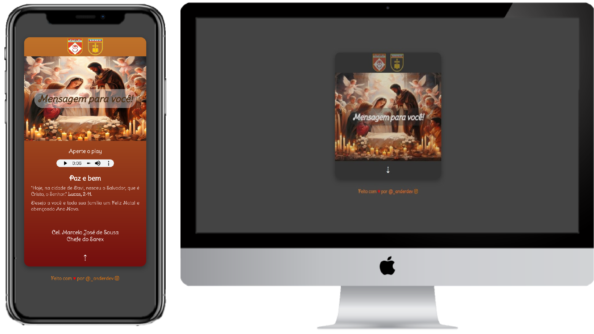

# Cartão de Natal Personalizado

[Experimente agora o Cartão de Natal Personalizado](https://card-natal-cel-marcelo-jose-de-sousa-chefe-do-sarex.vercel.app/)

<h3 align="center">
  Seja bem-vindo ao projeto que fiz como freelancer de um Cartão de Natal Personalizado
</h3>

 

  <a href="#house-sobre-o-projeto">Sobre o Projeto</a>&nbsp;&nbsp;&nbsp;|&nbsp;&nbsp;&nbsp;
  <a href="#gear-funcionalidades">Funcionalidades</a>&nbsp;&nbsp;&nbsp;|&nbsp;&nbsp;&nbsp;
  <a href="#man_shrugging-como-funciona">Como Funciona</a>&nbsp;&nbsp;&nbsp;|&nbsp;&nbsp;&nbsp;
  <a href="#open_book-como-usar">Como Usar</a>&nbsp;&nbsp;&nbsp;|&nbsp;&nbsp;&nbsp;
  <a href="#zap-tecnologias">Tecnologias</a>&nbsp;&nbsp;&nbsp;|&nbsp;&nbsp;&nbsp;
  <a href="#balance_scale-licença">Licença</a>&nbsp;&nbsp;&nbsp;|&nbsp;&nbsp;&nbsp;
  <a href="#man_technologist-autor">Autor</a>

 

  

 

## :house: Sobre o Projeto

Este projeto consiste em um cartão de Natal personalizado desenvolvido para transmitir votos de paz e felicidade durante a temporada festiva. E incorpora elementos visuais e sonoros para criar uma experiência única.

## :gear: Funcionalidades

O projeto possui as seguintes funcionalidades:

1. Uma mensagem especial é apresentada, acompanhada por uma citação bíblica relevante, transmitindo votos de Feliz Natal e Ano Novo.

2. O cartão inclui um elemento de áudio que reproduz uma mensagem especial ao pressionar o botão de reprodução, proporcionando uma experiência auditiva única.

3. O design é responsivo, adaptando-se a diferentes tamanhos de tela para garantir uma experiência consistente em dispositivos variados.

## :man_shrugging: Como Funciona

O usuário abre o cartão em um navegador da web, uma mensagem de Natal especial é exibida no centro do cartão, destacando votos de Feliz Natal e Ano Novo. Essa mensagem é acompanhada por uma citação bíblica relevante, o usuário é convidado a apertar o botão de play no elemento de áudio para ouvir uma mensagem sonora especial, adicionando um toque auditivo à experiência.
## :open_book: Como Usar

1. Acesse o [Cartão de Natal](https://card-natal-cel-marcelo-jose-de-sousa-chefe-do-sarex.vercel.app/) pela nossa fã page online. Ou Clone este repositório em seu ambiente de desenvolvimento.

2. Abra o arquivo index.html em seu navegador favorito.

3. Aprecie a mensagem de Natal e compartilhe-a com amigos e familiares.

## :zap: Tecnologias

-  : Contendo toda a estrutura HTML da página.
-  : Estilização de toda a página.

## :balance_scale: Licença

Este projeto é de código aberto e está sob a licença exclusiva. Você é livre para usar, modificar e distribuir este projeto de acordo com os termos da licença.

## :man_technologist: Autor

Feito com ♥ por [Anderson Leite | Desenvolvedor Front-end - Entre em contato](https://www.linkedin.com/in/andersondiasleite/) :wave:

